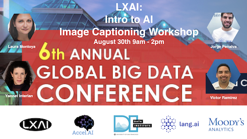

# Intro-Image-Captioning
GBDSC Workshop Intro to AI including AWS, CV, NLP, and Image Captioning

In this four hour workshop, members of the Latinx in AI Coalition will be sharing presentation and labs to introduce audience to introductory to advanced artificial intelligence concepts, theory, and applications. We'll begin with a guided walkthrough of accessing a computing environment utilizing the cloud AWS Deep Learning AMI (Amazon Machine Image). The second section will introduce Pytorch for deep learning and computer vision techniques including CNNs. Third, we'll focus on concepts in natural language processing including intro to linguistics concepts for preprocessing datasets (tokenization, lemmatization etc) with Spacy, embeddings including a few examples of bias, and RNNs with embeddings of the data as an input. Finally, we'll demo an example of image captioning in Pytorch to emphasize the relationship between CV and NLP for advanced AI applications.

**Presenters:**
Laura Montoya, Founder @ Accel.AI & Co-Chair LXAI
Yannet Interian, Assistant Professor @ University of San Francisco
Jorge Penalva, CEO @ Lang.ai
Victor Ramirez, Associate Director DevOps @ Moody's Analytics

## Setup

### Local Installation

Step-by-step guides for setting up a local Anaconda environment can be found here:  
[workshop installation guides](https://github.com/AccelAI/AI-Workshop-Installation-Guides) directory.

If you already have Pytorch installed on your local machine through an Anaconda distribution, simply clone this repository in your prefered directory, cd into the cloned directory, and type `jupyter notebook` to get started (it will appear in a new browser window or tab).

If you are not able to launch Jupyter Notebook inside your Pytorch virtual environment execute the following once inside this project directory:

`pip install ipykernel
python -m ipykernel install --user --name=my-virtualenv-name`

**Replace "my-virtualenv-name" with the name of your environment.**

### AWS Deep Learning AMI

You may find the guided walkthrough of the AWS Deep Learning AMI to follow along with [here](https://github.com/latinxinai/AWS-Deep-Learning-AMI-Demo/blob/master/Global%20Big%20Data%20Conference-2018/Step%20by%20Step%20Guide/Get%20started%20with%20deep%20learning%20using%20the%20AWS%20Deep%20Learning%20AMIs.pdf).

## Intro to CV in PyTorch

Slides can be found [here](https://github.com/latinxinai/Intro-Image-Captioning/blob/master/pdf/slides/cv.pdf).

You may find the code walkthrough for this segment [here](https://github.com/latinxinai/Intro-Image-Captioning/blob/master/Intro_to_CV_in_Pytorch.ipynb).

## Intro to NLP

Slides can be found [here](https://github.com/latinxinai/Intro-Image-Captioning/blob/master/pdf/slides/nlp.pdf)

You may find the code walkthrough for this segment [here](https://github.com/latinxinai/Intro-Image-Captioning/blob/master/Intro_to_NLP).

## Image Captioning 

You may find the demo of image captioning in Pytorch [here](https://github.com/latinxinai/pytorch-tutorials/blob/master/image-caption-tutorial.ipynb).

